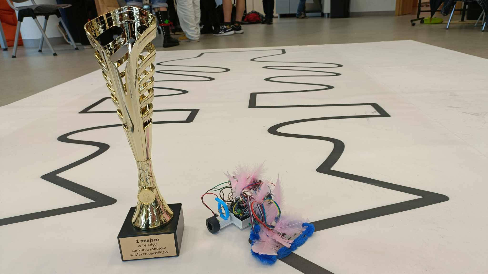
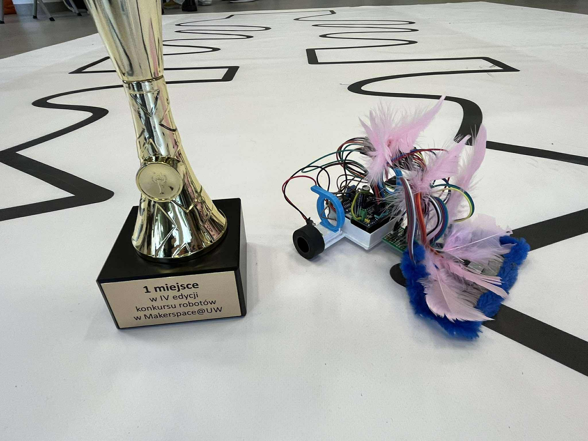
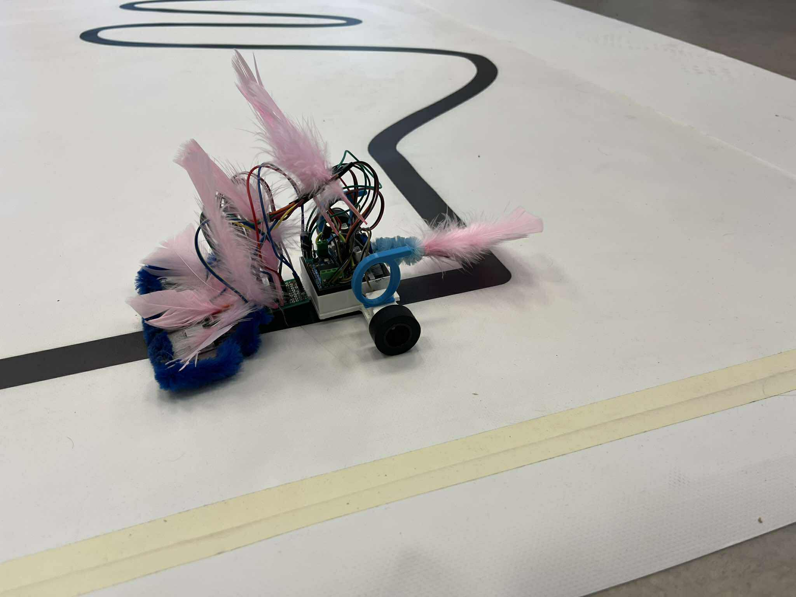

# line-follower
Line follower for robot competition

## Introduction

This repository holds design and code of a line follower robot built for a racing competition which took place on 2025-06-11T17:00+0100 at the Faculty of Physics of University of Warsaw. The robot competed against five other machines and its score was based on the best time in three rounds. Machine built using contents of this repository won the first place with time 00:00:32,90. 
The team included:

* Jan Gers (captain)
* Tomasz Pniewski
* Magdalena Latała
* Maria Waligórska
* Wojciech Knop

Supervisor: Piotr Kaźmierczak

## Construction

### Hardware
1. **Chassis**  
	The chassis was 3D-printed with PLA on Prusa i3 MK3 from files: `./assets/chassis-model.stl`, `./assets/robot-motor-board.stl` and `./assets/robot-motor-shell.stl`. The motor shells were glued to the main body and motors put in them were later immobilized by boards.
2. **Electronics**  
	This is a list of parts used:
	
	|Part|Count|
	|---|---|
	|N20-BT03 micro 10:1 3000RPM - 12V|2|
	|KTIR0711S on 9x14 mm board with pins|7|
	|Solarbotics RW2i|2|
	|Pico Motor Driver HAT|1|
	|Raspberry Pi Pico H|1|
	|Step-down LM2596|1|
	|SparkFun BOB-13906|1|
	|9 V battery + clip|1|
	|Iduino ST1089|1|
	|Wires|a lot|
		
3. **Wiring**  
	Sensor output was connected through the multiplexer. Multiplexer control was connected to pins `27`,`12`,`13` and its output to analog pin `28`. IR sensor was connected to pin `26`. Motor control was done with pins `16`,`17`,`18`,`19`,`20`,`21` through dedicated ports on the driver HAT. The final construction was not utilizing the IR capability because of time reasons, but it should be functional or otherwise require a few tweaks. Step-down was connected to dedicated ports in the driver HAT and set to 8 V output for stability.
	
3. **Decorations**
	Because the team's name is 'Sigmas' we decided to glue small sigmas at the top of the motor shells. Since the track was getting dirty quickly, we wrapped a pipe cleaner around the sensor tray to act as a brush, which is both elegant and functional. To cover the wires we used synthetic pink feathers. We were quite happy with the avant-garde eclectic style of the robot.
	
### Software

The main loop is done with PD algorithm tweaked to the particular track. The program handles the exception of seeing no line (essential on a track with very sharp turns) by keeping memory of the last position of the line seen by the leftmost or rightmost sensor. Majority voting with this memory buffer decides on the direction of sharp turn which continues until any sensor sees black line again.

The code is hopefully well-documented and self-explanatory. The files which must be put in the Pico memory are `./code/main.py`, `./code/buffer.py`, `./code/motors.py`, `./code/pid.py` and `./code/sensors.py`. All alterations to the PD constants and motor speed shall be done inside `main.py`.

## The competition

This machine won with the best time 00:00:32,90. Below are some multimedia created during the event:

